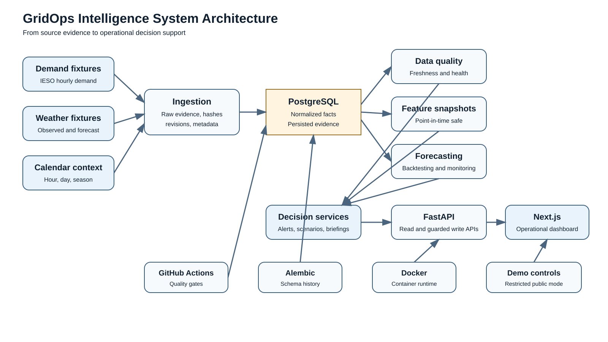
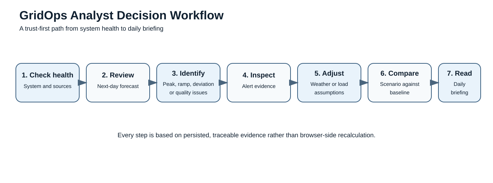

# GridOps Intelligence Architecture

## Product boundary

GridOps Intelligence is an evidence-oriented Ontario electricity-demand decision-support application. It preserves and presents analytical records; it does not operate the grid, replace official forecasts, or make operational declarations.

## System architecture



### Data and evidence flow

1. Fixture-backed demand, weather, and calendar inputs enter the ingestion layer.
2. Raw source evidence, hashes, retrieval metadata, and revision state are preserved.
3. Normalized facts are stored in PostgreSQL using timezone-aware UTC timestamps while retaining source-native IESO fields.
4. Persisted quality checks evaluate freshness, completeness, continuity, uniqueness, range, and source health.
5. Point-in-time-safe feature snapshots support leakage-aware backtesting and forecast evaluation.
6. Forecast generation produces persisted hourly outputs, peak and ramp context, and monitoring summaries.
7. Alert, scenario, and briefing services convert analytical outputs into deterministic decision-support evidence.
8. FastAPI exposes the stored records to the Next.js dashboard.
9. The frontend presents evidence but does not recalculate forecasts, alerts, or quality metrics.

## Analyst decision workflow



The product flow is intentionally ordered around trust:

- Confirm that the application and sources are healthy.
- Review the next-day demand forecast.
- Identify hours with peak, ramp, deviation, or data-quality attention conditions.
- Inspect the evidence behind each alert.
- Adjust bounded weather or load assumptions.
- Compare the scenario result with the baseline forecast.
- Review the structured daily briefing.

## Storage and services

- PostgreSQL is the system of record.
- Alembic owns schema history.
- Raw evidence includes content hashes, source identifiers, source-native fields, retrieval metadata, and revision state.
- Canonical operational timestamps are timezone-aware UTC.
- Dashboard presentation uses `America/Toronto`.
- IESO hour-ending fields remain preserved separately.
- Quality, forecast, alert, scenario, and briefing records are persisted before presentation.

## Backend

The Python 3.12 backend uses FastAPI, Pydantic Settings, SQLAlchemy 2.x, Alembic, and PostgreSQL.

- `/health` is a process probe.
- `/readiness` verifies PostgreSQL connectivity safely.
- Browser origins are configured with `GRIDOPS_CORS_ALLOWED_ORIGINS`.
- Wildcard CORS is rejected in production.
- Demo mode keeps reads available while restricting mutation routes.
- Scenario requests require finite values and configured server-side bounds.

## Dashboard

The Next.js App Router dashboard includes:

- Overview
- Forecasts
- Alerts and alert detail
- Data quality
- Scenarios
- Briefing
- Model performance
- System status
- Product documentation

`NEXT_PUBLIC_GRIDOPS_API_BASE_URL` configures the backend API.

Fixture fallback requires `NEXT_PUBLIC_GRIDOPS_USE_DEMO_DATA=true`, activates only after a backend request fails, and is visibly labeled.

## Deployment shape

The supported lightweight topology is:

```text
User
  -> Vercel-compatible Next.js frontend
  -> HTTPS FastAPI container service
  -> Managed PostgreSQL
```

The repository includes:

- A non-root FastAPI container image
- GitHub Actions quality gates
- Alembic migrations
- Explicit CORS configuration
- Public demo restrictions
- Frontend fixture fallback for demonstration continuity

No public hosted environment or live ingestion deployment is claimed yet.

## Safety and operational boundaries

Public demo mode (`GRIDOPS_DEMO_MODE=true`) allows reads but returns `403` for:

- Alert evaluation
- Alert lifecycle changes
- Briefing generation

Bounded scenarios remain available after server-side validation.

The platform does not:

- Control electricity infrastructure
- Dispatch resources
- Issue emergency declarations
- Replace official IESO forecasts
- Provide trading recommendations
- Perform power-flow calculations
- Make unsupported causal claims

## Deliberately absent

The implemented release does not include:

- Live source clients
- Production scheduling or Prefect orchestration
- A dbt project
- MLflow registry
- Authentication
- Notification delivery
- True quantile prediction intervals
- Verified production reliability

See [KNOWN_LIMITATIONS.md](KNOWN_LIMITATIONS.md).
